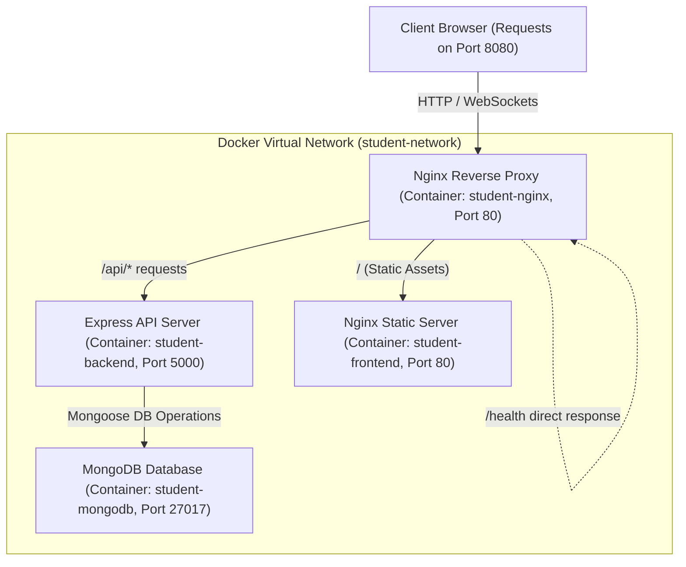
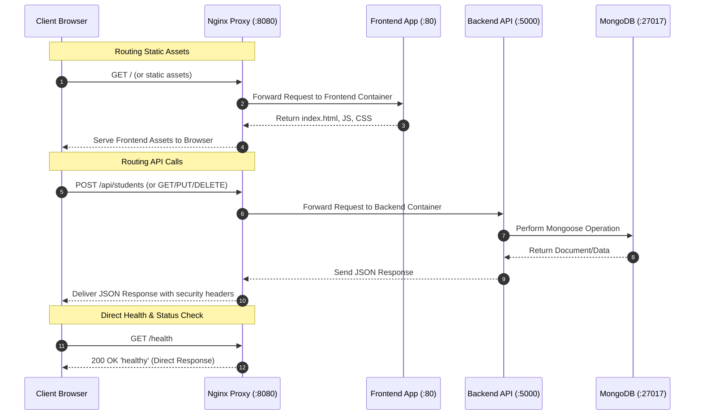

# Student Management System with Nginx Reverse Proxy

A production-ready MERN stack application built with a microservices-style architecture. This application allows educational institutions to manage student records, register new students, track grades, and view dashboard statistics. It leverages an **Nginx Reverse Proxy** to route frontend assets and backend API requests securely, efficiently, and under a unified port.

---

## Architecture and Request Flow

The system is containerized using Docker and organized under a single bridge network (`student-network`). The Nginx reverse proxy acts as the entry point for all traffic, routing requests dynamically based on URL patterns.

### System Architecture



### Request Sequence



---

## Project Structure

```
3.ReverseProxy-1/
├── backend/                                   # Express Backend API
│   ├── middleware/
│   │   └── validation.js                      # Request input validation schemas
│   ├── models/
│   │   └── Student.js                         # Mongoose Schema & pre-save hook
│   ├── routes/
│   │   └── studentRoutes.js                   # REST API Endpoints
│   ├── .dockerignore                          # Files ignored by Docker daemon
│   ├── .env                                   # Production Environment variables
│   ├── .env.dev                               # Local development Environment variables
│   ├── Dockerfile                             # Container build file for backend
│   ├── package-lock.json
│   ├── package.json                           # Dependencies & run scripts
│   └── server.js                              # Main server entry & DB connection
├── frontend/                                  # React Frontend Application
│   ├── public/                                # Public assets
│   ├── src/                                   # Application Source Code
│   │   ├── assets/                            # Custom SVG/images
│   │   ├── components/                        # UI Components
│   │   │   ├── StudentForm.jsx                # Student registration form
│   │   │   ├── StudentList.jsx                # List view & pagination controller
│   │   │   └── StudentTable.jsx               # Visual records table
│   │   ├── services/
│   │   │   └── api.js                         # Axios configuration & API client
│   │   ├── styles/
│   │   │   └── main.css                       # Layout, custom color design variables
│   │   ├── App.css
│   │   ├── App.jsx                            # Core React layout
│   │   ├── index.css                          # Base style resets
│   │   └── main.jsx                           # Application entry point
│   ├── .dockerignore
│   ├── .env                                   # API Endpoint configuration
│   ├── .env.example
│   ├── .gitignore
│   ├── Dockerfile                             # Multi-stage production build (build -> nginx serve)
│   ├── README.md
│   ├── dev.vite.config.js                     # Vite configuration for local dev
│   ├── eslint.config.js
│   ├── index.html
│   ├── package-lock.json
│   ├── package.json
│   └── vite.config.js                         # Vite configuration for Docker build
├── nginx/                                     # Nginx configurations
│   └── nginx.conf                             # Main Nginx Reverse Proxy config
├── .dockerignore
├── .gitignore
├── docker-compose.yml                         # Services orchestration config
├── nginx_proxy_lab.postman_collection.json    # Comprehensive API tests
└── nginx_proxy_lab.postman_environment.json   # Postman local variables config
```

---

## Technology Stack

- **Frontend**: React 19, Vite 8, Axios, Vanilla CSS (harmonious color variables, responsive grid system)
- **Backend**: Node.js, Express.js (Express 5), Mongoose ODM (Mongoose 9)
- **Database**: MongoDB 7
- **Reverse Proxy / Server**: Nginx (Main reverse proxy & Frontend container production server)
- **Security & Reliability**: Helmet (secure HTTP headers), express-rate-limit (API rate limiting), express-validator (strict payload schemas)
- **Performance**: Nginx Gzip compression & Express compression middleware
- **Containerization**: Docker (Multi-stage builds), Docker Compose

---

## Features

- **Automated Student ID Generation**: Pre-save hook automatically computes year-based IDs (`STU202600001`, `STU202600002`).
- **Comprehensive Profiles**: Collects student information, full nested address, emergency contacts, GPA, courses enrollment list, and student status.
- **RESTful API CRUD Operations**: Fully-functional create, retrieve, update, delete, pagination, and dashboard summary queries.
- **Secure Reverse Proxy Layer**: Prevents CORS issues by matching ports, hides the backend version header, restricts stub_status access, and enforces security policies (`X-Frame-Options`, `X-Content-Type-Options`).
- **API Protection**: Express-rate-limit limits traffic to 100 requests per 15-minute window; inputs are validated on the backend before being processed.

---

## Configuration and Environment Variables

### Backend Environment Config
The backend expects the following variables, configured in [backend/.env](file:///d:/devops-labs/ngnix-lab/3.ReverseProxy-1/backend/.env) (Docker production) and [backend/.env.dev](file:///d:/devops-labs/ngnix-lab/3.ReverseProxy-1/backend/.env.dev) (Local node development):

| Variable | Description | Local Dev Value | Docker Production Value |
| :--- | :--- | :--- | :--- |
| `PORT` | Listening port for Express server | `5000` | `5000` |
| `NODE_ENV` | Running environment mode | `development` | `production` |
| `MONGODB_URI` | Connection string to MongoDB | `mongodb://localhost:27017/studentdb` | `mongodb://mongodb:27017/studentdb` |
| `CORS_ORIGIN` | Authorized CORS domains | `http://localhost:5173,http://localhost:8080` | `http://localhost:8080` |
| `RATE_LIMIT_WINDOW_MS` | Window duration for rate-limiting (ms) | `900000` (15 mins) | `900000` (15 mins) |
| `RATE_LIMIT_MAX_REQUESTS`| Max request counts within window limit | `100` | `100` |

---

## Installation and Running the Application

### Option A: Running with Docker Compose (Recommended)

To run the entire multi-container architecture locally using Docker:

1. **Verify Docker Status**:
   Ensure Docker Desktop is running on your system.

2. **Launch Services**:
   Navigate to the root directory and build/start the containers:
   ```bash
   docker compose up --build
   ```

3. **Verify running containers**:
   ```bash
   docker compose ps
   ```
   You should see 4 active containers:
   - `student-nginx` (Host port `8080` -> Container port `80`)
   - `student-frontend` (Host port `80` -> Container port `80`)
   - `student-backend` (Host port `5000` -> Container port `5000`)
   - `student-mongodb` (Host port `27017` -> Container port `27017`)

4. **Access the System**:
   - **Frontend via Reverse Proxy**: [http://localhost:8080](http://localhost:8080)
   - **Proxy Health check**: [http://localhost:8080/health](http://localhost:8080/health)
   - **Backend health status**: [http://localhost:8080/api/health](http://localhost:8080/api/health)
   - **Direct Backend server**: [http://localhost:5000/health](http://localhost:5000/health)

---

### Option B: Running Locally (For Active Development)

For local development without Docker, run services independently:

#### 1. Setup Database
Ensure MongoDB is installed and running on your local machine on port `27017`.
- Alternatively, run a temporary MongoDB instance using Docker:
  ```bash
  docker run -d --name mongodb-local -p 27017:27017 mongo:7
  ```

#### 2. Start the Backend API
1. Navigate to the backend folder:
   ```bash
   cd backend
   ```
2. Install dependencies:
   ```bash
   npm install
   ```
3. Start in development mode (runs nodemon with `.env.dev` context):
   ```bash
   npm run dev
   ```
   The backend will start at [http://localhost:5000](http://localhost:5000).

#### 3. Start the Frontend Application
1. Navigate to the frontend folder:
   ```bash
   cd frontend
   ```
2. Install dependencies:
   ```bash
   npm install
   ```
3. Start the Vite development server using the local configurations:
   ```bash
   npm run dev -- --config dev.vite.config.js
   ```
   The frontend app will launch at [http://localhost:5173](http://localhost:5173). Requests to `/api` will be proxied automatically to `http://localhost:5000` via Vite's dev proxy rules.

---

## API Endpoints Reference

All API endpoints reside behind the `/api` prefix (routed through Nginx or Vite Proxy).

### Health Checks
* **Nginx Proxy Health**: `GET /health` (Directly returned by proxy container)
* **Backend System Health**: `GET /api/health` (Shows node server runtime status, system uptime, and MongoDB connection status)

### Student Endpoints
* **Create Student**: `POST /api/students`
  * Validates details and generates unique ID.
* **Get All Students**: `GET /api/students`
  * Supported Query Params: `page` (default: 1), `limit` (default: 20), `grade`, `section`, `status`, `search` (searches firstName, lastName, email, studentId).
* **Get Student by ID**: `GET /api/students/:id`
* **Update Student**: `PUT /api/students/:id`
* **Delete Student**: `DELETE /api/students/:id`
* **Stats Summary**: `GET /api/students/stats/summary`
  * Returns dashboard metrics (total students, active count, inactive count, and student enrollment distribution per grade level).

---

## Testing and Verification

A Postman collection is included in the workspace to assist in testing Nginx routing, proxy rules, and backend controllers.

1. **Import Files into Postman**:
   - Open Postman and click **Import**.
   - Select [nginx_proxy_lab.postman_collection.json](file:///d:/devops-labs/ngnix-lab/3.ReverseProxy-1/nginx_proxy_lab.postman_collection.json) and [nginx_proxy_lab.postman_environment.json](file:///d:/devops-labs/ngnix-lab/3.ReverseProxy-1/nginx_proxy_lab.postman_environment.json).
2. **Select the Environment**:
   - In Postman, switch your active environment to **Nginx Proxy Lab - Environment**.
3. **Execute Requests**:
   - Run individual requests sequentially (1 through 9) or use the **Collection Runner** to run all tests automatically.
   - The test script verifies Nginx routing policies, returns data structures, saves the created Student `_id` into a variable, updates, and deletes records under the `/api` path.