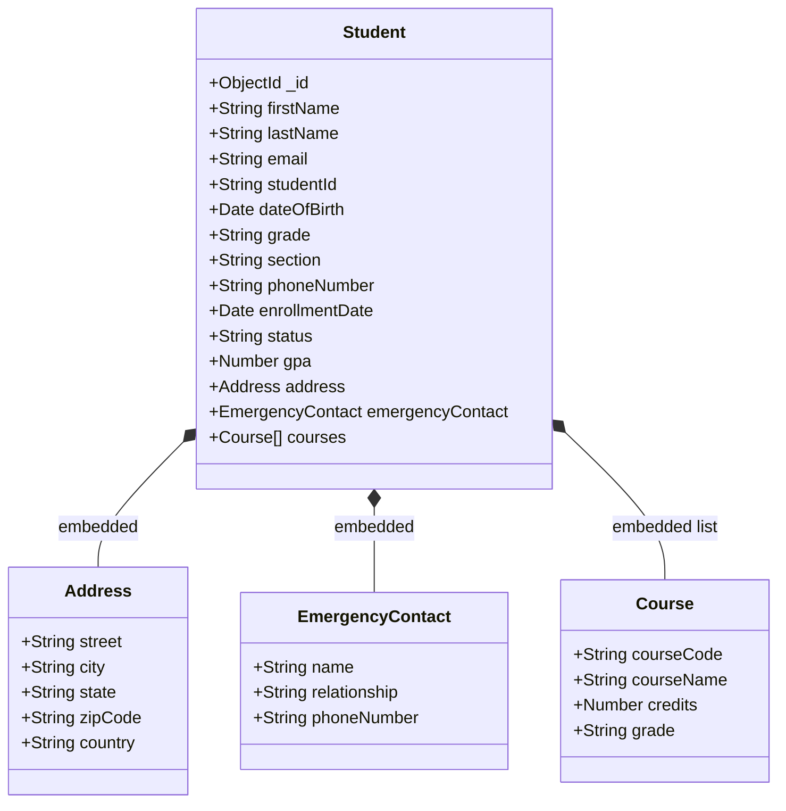
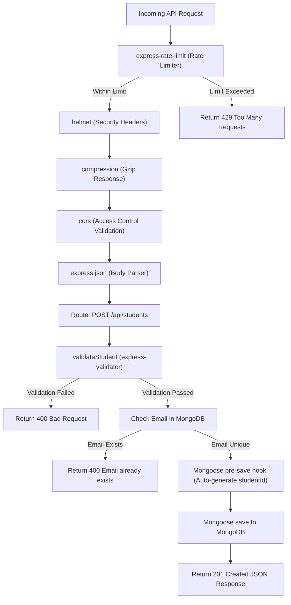

# Technical Diagrams for Student Management System

This document contains additional structural and behavioral diagrams for the Student Management System to explain the database model design and request lifecycle.

---

## 1. Database Schema structure (Entity Relationship Layout)

The database runs on MongoDB. Although MongoDB is document-oriented, the application defines a structured schema with embedded subdocuments using Mongoose. The following class diagram illustrates the nested object structure of the Student model.

---

## 2. Express.js Middleware Processing Pipeline

When a client makes a request to the backend REST API (such as submitting the registration form via `POST /api/students`), the request is passed through several security, parsing, validation, and database verification steps. The diagram below illustrates this lifecycle:

