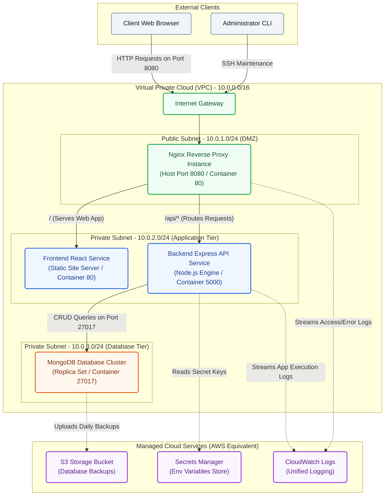

# Cloud Deployment Network Architecture

This document defines a production-ready cloud deployment network topology for the Student Management System. It maps the local Docker Compose services into a Virtual Private Cloud (VPC) design following industry-standard multi-tier architecture guidelines (Public DMZ Subnet, Private Application Subnet, and Private Database Subnet).

---

## Network Architecture Diagram

The diagram below is written in **Mermaid.js** syntax. It is entirely text-based and programmatically editable inside any Markdown viewer or code editor.

---

## Architectural Summary

### 1. External Clients Tier
- **Client Web Browser**: End-users who access the application interface.
- **Administrator CLI**: Systems administrators managing operations and running server configurations.

### 2. Public Subnet (DMZ)
- **Internet Gateway (IGW)**: Direct interface connecting the VPC to the public Internet.
- **Nginx Reverse Proxy Instance**: Exposed directly on port `8080`. It acts as the gatekeeper, receiving all client traffic, terminating requests, enforcing security configurations, and proxying incoming calls downstream.

### 3. Private Application Subnet
- **Frontend React Service**: Serves build bundles (`index.html`, JS, CSS). Isolated from direct public exposure; accessible only through Nginx proxy routing.
- **Backend Express API Service**: Node.js microservice running on port `5000`. It processes requests forwarded by Nginx and interfaces with MongoDB.

### 4. Private Database Subnet
- **MongoDB Database**: Data tier restricted to internal query access. It only accepts connections from the Backend application layer on port `27017`.

### 5. Managed Cloud Services
- **Secrets Manager**: Securely stores configurations (such as the database connection string `MONGODB_URI` and JWT secret keys).
- **CloudWatch Logs**: Centralized storage for streaming diagnostic logs from Nginx proxy servers and application runtimes.
- **S3 Storage Bucket**: Used for storing daily database snapshots and static media file uploads.
